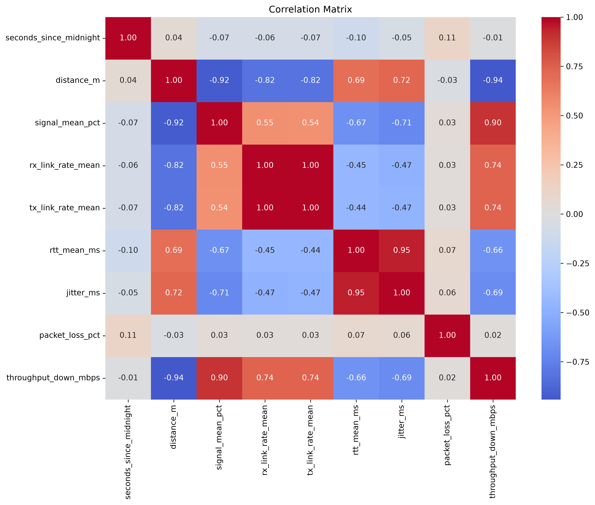

# DỰ ĐOÁN CHẤT LƯỢNG KẾT NỐI WIFI TỪ CÁC THÔNG SỐ ĐO Ở PHÍA THIẾT BỊ NGƯỜI DÙNG

Repo này là phần Học máy (Machine Learning) thuộc bài tập nhóm của nhóm 7, thuộc lớp COSH201(2627-HK1)GD1.1

---
## 1. Danh sách thành viên
| Thành viên            |     MSSV     |
| --------------------- | ------------ |
| `Khúc Văn Tuấn Anh`   | `2519960005` |
| `Trần Thị Ngọc Ánh`   | `2519960007` |
| `Hán Huy Gia Bảo`     | `2519960008` |
| `Phạm Vũ Hoàng Hà`    | `2519960014` |
| `Phạm Thị Ngọc Minh`  | `2519960037` | 

---
## 2. Bài toán

Từ dữ liệu thông số Wi-Fi quan sát được từ thiết bị client, cần tạo một mô hình có khả năng đưa ra dự đoán về chất lượng kết nối.

---

## 3. Yêu cầu về môi trường và Python version

Để có trải nghiêm tối ưu, hãy đảm bảo trên máy tính có:
- Một IDE hỗ trợ mở file `.ipynb` như PyCharm hoặc Jupyter Lab/Notebook
- Python (3.14 trở lên)


---

## 4. Thư viện 

Để có thể chạy toàn bộ repo này, hãy đảm bảo trên máy tính có tất cả các thư viện sau:
```text
pandas
numpy
scikit-learn
matplotlib
seaborn
joblib
streamlit
```

Để tải những thư viện này qua `requirements.txt`, hãy vào trong directory của project này, mở Terminal và chạy:

```text
pip install -r requirements.txt
```

---

## 5. Dataset

Dataset được sử dụng trong bài tập này đuợc thu lại bằng script được nhóm viết tại [link](https://github.com/hhgbao/wifi-data-collection).

Trong repo này, dataset được lưu tại `data\raw\data-raw.csv`.

---
## 6. Cấu trúc thư mục
```text
wifi-quality-ml/
│
├── data/
│   ├── raw/
│   │   └── data-raw.csv
│   │
│   ├── cleaned/
│   │   └── data-cleaned
│   │
│   ├── preprocessed/
│   │   ├── data_train.csv
│   │   └── data_test.csv
│   │
│   ├── prediction-baseline/
│   │   └── prediction_baseline.csv
│   │
│   └── prediction-linear-regression/
│       └── prediction_linear_regression.csv
│
├── media/
│   └── 02_05.png
│   └── ...
│
├── models/
│   └── linear_regression_model.joblib
│
├── notebooks/
│   ├── 01_data_cleaning.ipynb
│   ├── 02_eda.ipynb
│   ├── 03_preprocessing.ipynb
│   ├── 04_baseline.ipynb
│   ├── 05_linear_regression.ipynb
│   └── 06_analysis.ipynb
│
├── app.py
├── optional.py
├── requirements.txt
└── README.md
```

---
## 7. Thứ tự chạy notebook

Thứ tự sử dụng các file trong repo như sau:

```text
                  (Tùy chọn)
                Xóa dữ liệu đã 
                qua xử lý bằng
                  optional.py
                       │
                       ▼
              Xem dữ liệu thô tại
                 data-raw.csv
                       │
                       ▼
             Làm sạch dữ liệu trong
             01_data_cleaning.ipynb
                       │
                       ▼
           Exploratory Data Analysis
              trong 02_eda.ipynb
                       │
                       ▼
              Preprocessing trong
             03_preprocessing.ipynb
                       │
               ┌───────┴───────┐
               ▼               ▼
        Dự đoán bằng         Dự đoán bằng
        Mean Baseline     Linear Regression
           trong                trong
     04_baseline.ipynb   05_linear_regression.ipynb
               │               │
               └───────┬───────┘
                       │
                       ▼
                  Phân tích và    
                   so sánh hai     
                  mô hình trong
                06_analysis.ipynb
                       │
                       ▼
                  Streamlit App
                  trong app.py
```


Giải thích nội dung các file:

| File      | Nội dung |
| ------------- | ---------|
| `app.py` | (Tùy chọn) Xóa các file dữ liệu đã qua xử lý được lưu trong thư mục `/data/`. Cho phép theo dõi quá trình xử lý và lưu lại các dataset này khi sử dụng các notebook. <br/> Sẽ không xóa dữ liệu thô hay model  |
| `data-raw.csv`   | Chứa dataset chưa qua xử lý |
| `01_data_cleaning.ipynb`   | Xử lý dữ liệu để sẵn sàng cho khám phá dữ liệu |
| `02_eda.ipynb`      | Phân tích khám phá dữ liệu (EDA - Exploratory Data Analysis)       |  
| `03_preprocessing.ipynb` | Xử lý dữ liệu để sẵn sàng cho các bước học máy |
| `04_baseline.ipynb` | Tạo ra và dự đoán bằng mô hình Baseline |
| `05_linear_regression.ipynb` | Tạo ra, train và dự đoán bằng  mô hình Linear Regression |
| `06_analysis.ipynb` | Phân tích và so sánh kết quả dự đoán giữa hai mô hình với nhau và với đáp án đúng   |
| `app.py` | Chạy mô hình đã train để đưa ra dự đoán cho giá trị băng thông |


## Hướng dẫn sử dụng repo:

### Để theo dõi từng bước của quá trình học máy
- Bước 0 (Tùy chọn): Trong directory, mở Terminal và chạy 
```text
python optional.py
```
- Bước 1: Mở notebook `01_data_cleaning.ipynb` trong IDE có hỗ trợ file `.ipynb`
- Bước 2: Chạy các code cell, mỗi cell 1 lần, theo thứ tự từ đầu đến cuối notebook
- Bước 3: Lặp lại hai bước 1 và 2 với các notebook tiếp theo theo thứ tự đánh số

### Để chạy mô hình được train trước nhằm dự đoán băng thông từ các biến đầu vào được nhập
- Bước 1: Trong directory, mở Terminal và chạy 
```text
streamlit run app.py
```
- Bước 2: Điền lần lượt các biến đầu vào 
- Bước 3: Bấm nút "Dự đoán băng thông" để đưa ra dự đoán bằng mô hình Linear Regression

---

# 8. Output mong đợi

Ví dụ cho plot có thể tạo ra khi chạy notebook thành công:


---

# 9. Tái lập kết quả

Bài làm Machine Learning này sử dụng duy nhất `random_state = 911` trong cell code thứ 3, file `03_preprocessing.ipynb` cho Data Splitting. Để tái lập kết quả Machine Learning đạt được trong bài làm này, không thay đổi giá trị trên.

Trong trường hợp cần thực hiện Machine Learning với dataset khác, tại folder `data/raw/`, hãy dán dataset mới, xóa file `data-raw.csv` và đặt tên này cho dataset mới.

---

# 10. Giới hạn

Bài làm này hoạt động dưới giả định rằng tập dữ liệu thô tuân thủ cấu trúc được tạo ra bởi script thu dữ liệu.